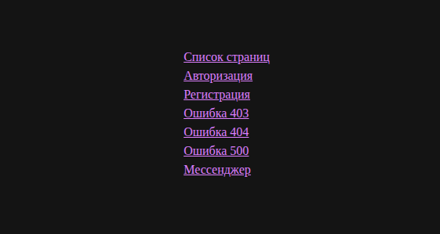
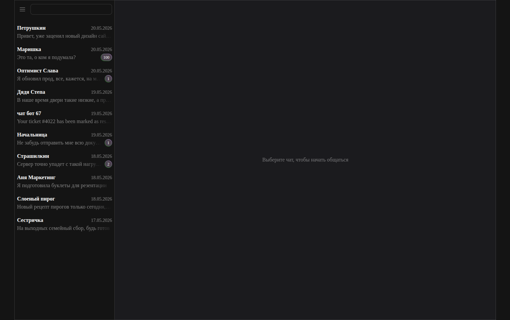
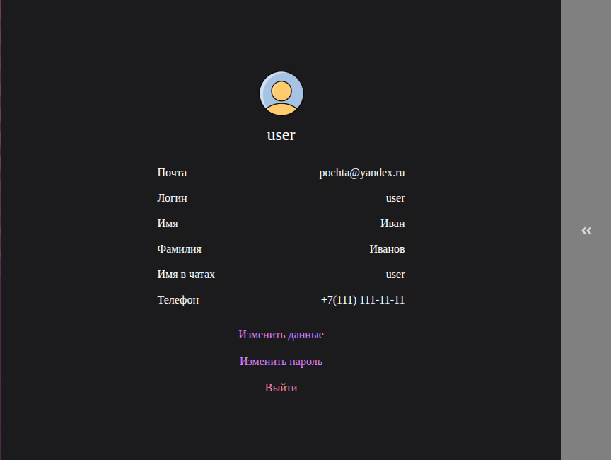

# Messenger App — Проект Яндекс.Практикум

Учебный проект по разработке веб-мессенджера. В течение 4-х спринтов создается полноценное приложение с использованием современных инструментов фронтенд-разработки.

[Ссылка на проект](https://jade-druid-e56a7c.netlify.app)

---

## Спринт 3: Интеграция с API и полноценный роутинг

Реализована интеграция с серверным API, авторизация пользователей и работа с чатами.

### Новые возможности

#### Авторизация и аутентификация

- **Регистрация пользователя** — создание аккаунта с валидацией данных и автоматическим перенаправлением в мессенджер.
- **Вход в систему** — авторизация с проверкой учетных данных через API.
- **Выход из системы** — очистка сессии и перенаправление на страницу входа.
- **Защита маршрутов** — автоматический редирект неавторизованных пользователей на страницу входа через `routeRules` в роутере.

#### Управление профилем

- **Получение данных пользователя** — загрузка профиля при входе и при обновлении страницы.
- **Изменение данных профиля** — обновление данных пользователя через API.
- **Смена пароля** — изменение пароля с проверкой текущего.
- **Загрузка аватара** — отправка изображения на сервер и отображение обновленного аватара.

#### Работа с чатами

- **Получение списка чатов** — загрузка всех доступных чатов пользователя.
- **Создание нового чата** — создание чата.
- **Добавление пользователей в чат** — поиск и добавление участников в существующий чат.
- **Удаление пользователей из чата** — исключение участников из группового чата.

#### Роутинг и навигация

- **Реализация SPA-роутера**:
  - Корректная работа истории браузера (кнопки «Назад» / «Вперёд»).
  - Сохранение текущей страницы при перезагрузке (F5).

#### Архитектурные улучшения

- **Контроллеры** — вынесение бизнес-логики из компонентов:
  - `AuthController` — управление авторизацией.
  - `UserController` — работа с профилем пользователя.
  - `ChatsController` — операции с чатами.
- **Стор (Store)** — централизованное хранение состояния приложения:
  - Данные пользователя, чатов, ошибки форм.
  - Подписки компонентов на изменения состояния.
  - Автоматическая перерисовка при обновлении данных.

---

## Спринт 2: Интерактивность и компонентная архитектура

Реализована клиентская логика: валидация форм, клиентский роутинг (SPA), компонентная архитектура на базе базового класса `Block`.

### Новые возможности

#### Архитектура

- **Базовый класс `Block`** — единая основа для всех компонентов:
  - Управление жизненным циклом (`componentDidMount`, `componentWillUnmount`).
  - Делегирование событий через `this.events`.
  - Работа с детьми через `this.children` и шаблонизацию через `{{{child}}}`.
- **Клиентский роутер `Router`** — навигация без перезагрузки:
  - Поддержка `pushState` / `popstate`.
  - Динамическая подстановка компонентов по пути.
  - Обработка 403/404/500 через единый `ErrorPage`.

#### Формы и валидация

- **Валидация в реальном времени**:
  - Проверка на `input` (блокировка кнопки отправки).
  - Проверка на `focusout` (показ ошибок после ухода с поля).
  - Кросс-валидация полей (совпадение паролей).
- **Правила валидации** (`FormValidator`):
  - Логин, почта, имя, телефон, пароль и т.д. — с понятными сообщениями об ошибках.
  - Поддержка режимов `strict` (финальная проверка) и `live` (подсказки при вводе).
- **Сбор данных формы** — вывод в консоль при успешной валидации (подготовка к отправке на бэкенд).

#### Компоненты

- **`Avatar`** — отображение аватара пользователя с поддержкой динамической подгрузки (Base64/URL).
- **`Button`** — универсальная кнопка с состоянием `disabled`, кастомными стилями и обработкой кликов.
- **`Input`** — поле ввода с делегированием событий `focusout`/`input`, динамическим показом ошибок и кастомными атрибутами.
- **`TextArea`** — многострочное текстовое поле с автоподстройкой высоты и обработкой ввода.
- **`InputError`** — изолированный компонент для отображения текста валидации под полем формы.
- **`ChannelCard`** — карточка чата в боковой панели: аватар, название, последнее сообщение, статус активности.
- **`ChannelWindow`** — основное окно диалога: лента сообщений, поле ввода текста, прикрепление изображений (Base64), отправка.
- **`Profile`** — модульный блок профиля с переключением режимов (`info` / `edit-fields` / `edit-password`) и ленивым рендером дочерних компонентов.

### Ограничения (Logic status)

- **Данные**: формы валидируются и выводят данные в консоль, но не отправляются на сервер.
- **Хранение**: состояние сбрасывается при перезагрузке (нет `localStorage`/бэкенда).
- **Роутинг**: клиентский, без проверки прав доступа (любой путь доступен).

---

## Спринт 1: Статическая верстка и архитектура _(архив)_

> Реализована статическая верстка, сборка и структура стилей. Детали — в истории коммитов.

---

## Технологический стек

| Инструмент             | Назначение                                             |
| ---------------------- | ------------------------------------------------------ |
| **Vite**               | Сборка проекта, дев-сервер, хот-релоад                 |
| **TypeScript**         | Строгая типизация, `noImplicitAny`, `strictNullChecks` |
| **Handlebars**         | Шаблонизация компонентов и страниц                     |
| **Sass (SCSS)**        | Стилизация с архитектурой (Helpers / Blocks / Globals) |
| **BEM**                | Методология именования классов                         |
| **ESLint + Stylelint** | Линтинг JS/TS и CSS/SCSS                               |
| **EditorConfig**       | Единый стиль форматирования в команде                  |

---

## Структура проекта (актуально)

```text
src/
├── core/                 # Базовая логика приложения
│   ├── Block.ts          # Базовый класс компонентов
│   ├── Router.ts         # Клиентский роутер
│   └── Validator.ts      # Правила валидации полей
├── components/           # Переиспользуемые UI-компоненты
│   ├── Input/
│   ├── Button/
│   ├── Avatar/
│   ├── InputError/
│   ├── TextArea/
│   ├── ChannelCard/
│   ├── ChannelWindow/
│   └── ...
├── pages/                # Страницы приложения
│   ├── navigation/
│   ├── error/
│   ├── login/
│   ├── register/
│   ├── profile/
│   └── messenger/
├── api/                  # API-клиенты (подготовка к бэкенду)
├── utils/                # Вспомогательные функции
├── styles/               # Глобальные стили (Sass)
└── scripts/              # Инициализация и точка входа
    ├── routes.ts         # конфигурация маршрутов
    └── main.ts           # Запуск приложения
```

---

## Визуализация

Скриншоты интерфейса доступны в папке `/screenshots`.

| Главная страница                    | Мессенджер                          | Профиль                               |
| :---------------------------------- | :---------------------------------- | :------------------------------------ |
|  |  |  |

---

## Установка и запуск

1.  **Установка зависимостей:**

    ```bash
    npm install
    ```

2.  **Проверка качества кода (рекомендуется перед коммитом):**

    ```bash
    npm run lint          # ESLint + Stylelint + проверка типов
    ```

3.  **Запуск в режиме разработки:**

    ```bash
    npm run dev
    ```

4.  **Сборка и запуск продакшн-версии (порт 3000):**
    ```bash
    npm run start
    ```
    _Выполняет: `typecheck` → `vite build` → `vite preview`_

---

## Команды разработки

| Команда             | Описание                                   |
| ------------------- | ------------------------------------------ |
| `npm run dev`       | Запуск дев-сервера с хот-релоадом          |
| `npm run build`     | Сборка проекта в `dist/` с проверкой типов |
| `npm run preview`   | Предпросмотр продакшн-сборки               |
| `npm run typecheck` | Проверка типов без генерации файлов        |
| `npm run lint:js`   | Линтинг TypeScript/JavaScript              |
| `npm run lint:css`  | Линтинг SCSS/CSS                           |
| `npm run lint`      | Полный чек: типы + JS + CSS                |
| `npm run start`     | Сборка + запуск продакшн-превью            |

---
